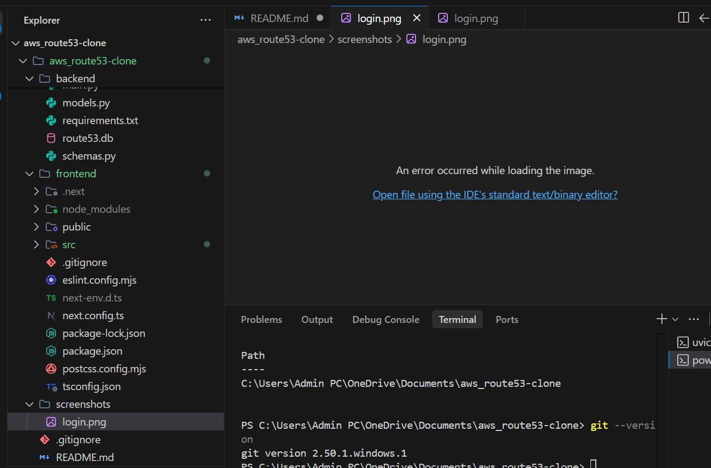
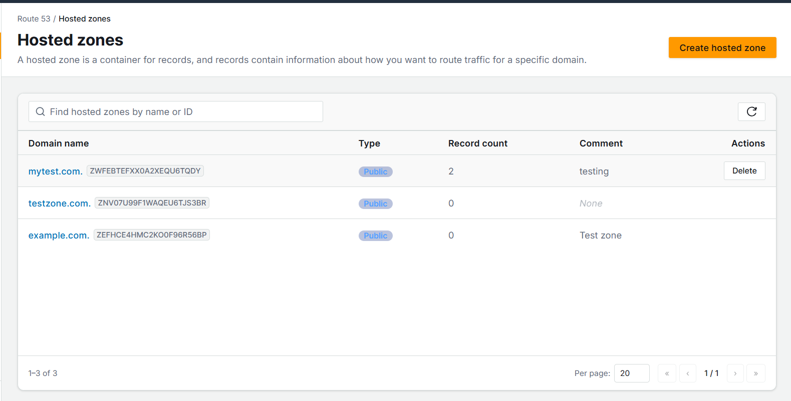
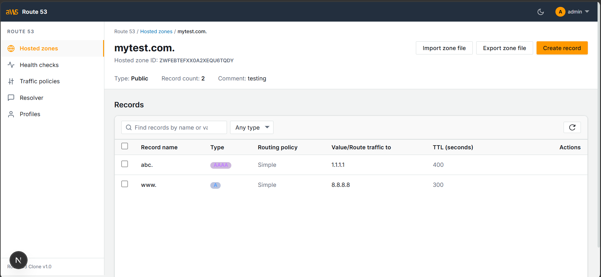
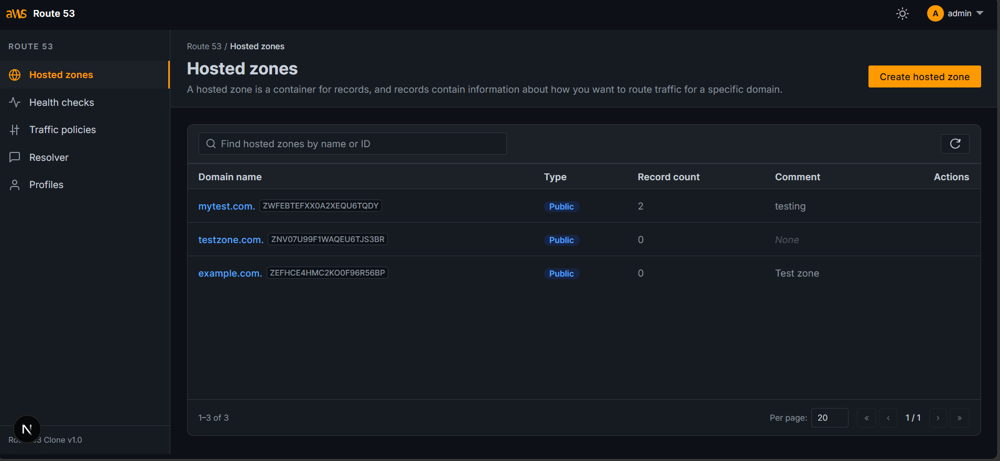

# AWS Route53 Clone

A full-stack clone of the AWS Route 53 management console built with Next.js, FastAPI, and SQLite. This project implements the core functionality of Route 53 including authentication, Hosted Zones management, and DNS Records management with a fully responsive and highly faithful AWS UI clone.

## Live Demo
Deployment pending.

## Tech Stack
**Frontend**
- Next.js 15
- TypeScript
- React
- Tailwind CSS

**Backend**
- FastAPI
- SQLAlchemy
- Pydantic v2
- JWT-based mocked authentication

**Database**
- SQLite

## Features
- **Faithful UI Clone:** Implements the AWS Management Console design system including the sidebar, header, navigation, breadcrumbs, tables, modals, and dark mode.
- **Authentication:** Mock JWT-based authentication implemented for demonstration purposes, with login, logout, and route protection.
- **Hosted Zones:** Full CRUD operations for public and private hosted zones with pagination and search.
- **DNS Records:** Full CRUD for A, AAAA, CNAME, TXT, MX, NS, PTR, SRV, and CAA records.
## Bonus Features
- Import DNS records from BIND zone files
- Export Hosted Zones as BIND format
- Bulk DNS Record operations
- Dark Mode
- Keyboard Shortcuts

## Mocked AWS Route53 Sections
The following pages are intentionally implemented as placeholder "Coming Soon" pages to match the original AWS Route53 console:
- Dashboard
- Traffic Policies
- Health Checks
- Resolver
- Profiles

---

## Demo Credentials
- **Username:** `admin`
- **Password:** `password`

*Note: These credentials are for the mocked authentication system used in this assignment.*

## Project Structure
```text
aws-route53-clone/
├── frontend/
├── backend/
└── README.md
```

## Setup Instructions

### Prerequisites
- Node.js (v18+)
- Python (3.10+)

### Backend Setup
1. Navigate to the backend directory:
   ```bash
   cd backend
   ```
2. Create and activate a virtual environment:
   ```bash
   python -m venv venv
   source venv/bin/activate  # On Windows use: venv\Scripts\activate
   ```
3. Install dependencies:
   ```bash
   pip install -r requirements.txt
   ```
4. Run the backend server:
   ```bash
   uvicorn main:app --reload
   ```
   The backend will be available at `http://127.0.0.1:8000`.

### Frontend Setup
1. Navigate to the frontend directory:
   ```bash
   cd frontend
   ```
2. Install dependencies:
   ```bash
   npm install
   ```
3. Run the development server:
   ```bash
   npm run dev
   ```
   The frontend will be available at `http://localhost:3000`.

---

## Architecture Overview
The application follows a standard decoupled full-stack architecture:

- **Frontend:** Next.js (App Router), React 18, and Tailwind CSS. It uses Context API for global state (Auth, Toasts) and custom hooks for API calls and keyboard shortcuts. The styling is driven by custom CSS variables modeled after AWS tokens (`--aws-bg`, `--aws-border`, etc.) to support seamless theming.
- **Backend:** FastAPI (Python) serving a RESTful JSON API.
- **Database:** SQLite via SQLAlchemy ORM. The database is stored locally in `route53.db`.
- **Authentication:** Mock JWT-based authentication implemented for demonstration purposes. Tokens are issued on login (`/api/auth/login`) and expected as a `Bearer` token in the `Authorization` header for protected endpoints. The frontend persists this in `localStorage`.

---

## Database Schema
The database uses SQLAlchemy and consists of three primary tables:

1. **users**
   - `id` (Integer, Primary Key)
   - `username` (String, Unique)
   - `password_hash` (String)
   - `created_at` (DateTime)

2. **hosted_zones**
   - `id` (Integer, Primary Key)
   - `zone_id` (String, Unique, e.g., "Z0...")
   - `name` (String, e.g., "example.com.")
   - `type` (String, "Public" or "Private")
   - `comment` (String, Nullable)
   - `record_count` (Integer, defaults to 0)
   - `created_at`, `updated_at` (DateTime)

3. **dns_records**
   - `id` (Integer, Primary Key)
   - `zone_id` (Integer, Foreign Key to `hosted_zones.id`)
   - `name` (String)
   - `type` (String, ENUM: A, AAAA, CNAME, TXT, etc.)
   - `ttl` (Integer)
   - `value` (String)
   - `routing_policy` (String)
   - `comment` (String, Nullable)
   - `created_at`, `updated_at` (DateTime)

---

## API Overview
The backend provides the following REST API endpoints under `/api`:

### Authentication
- `POST /auth/login` - Authenticate and receive a JWT.
- `POST /auth/logout` - Invalidate session (client side).
- `GET /auth/me` - Get current user profile.

### Hosted Zones
- `GET /hosted-zones/` - List zones (supports pagination `page`, `page_size`, and `search`).
- `POST /hosted-zones/` - Create a new hosted zone.
- `GET /hosted-zones/{zone_id}` - Get details of a specific hosted zone.
- `PUT /hosted-zones/{zone_id}` - Update a hosted zone's comment.
- `DELETE /hosted-zones/{zone_id}` - Delete a hosted zone and all its records.

### DNS Records
- `GET /hosted-zones/{zone_id}/records` - List records for a zone (supports pagination and filtering).
- `POST /hosted-zones/{zone_id}/records` - Create a single DNS record.
- `PUT /hosted-zones/{zone_id}/records/{record_id}` - Update a DNS record.
- `DELETE /hosted-zones/{zone_id}/records/{record_id}` - Delete a single DNS record.
- `POST /hosted-zones/{zone_id}/records/bulk-delete` - Delete multiple DNS records by ID.
- `POST /hosted-zones/{zone_id}/import` - Import BIND format string into the zone.

---

## Screenshots

### Login Page


### Hosted Zones


### DNS Records


### Dark Mode

